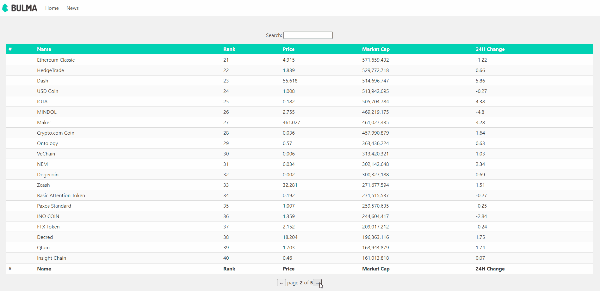

# Cryptolist (Vue.js + Bulma)
Display a list of crypto currencies and news related on a different section. Implemented pagination and search bar.

http://crypto-list-vue.herokuapp.com/

# About 
This is just a personal playground project built with Vue.js + Bulma CSS .



## Project setup
```
npm install
```

### Compiles and hot-reloads for development
```
npm run serve
```

### Compiles and minifies for production
```
npm run build
```

### Lints and fixes files
```
npm run lint
```

### Customize configuration
See [Configuration Reference](https://cli.vuejs.org/config/).
